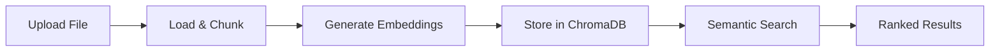

# 🧠 RAG Production Backend


> **Modular RAG Backend** — Ingest documents, generate vector embeddings, and serve semantic search via a clean FastAPI REST layer.

---

## 📐 Architecture



```
backend/
├── api.py                     # FastAPI app — /health, /upload, /search
├── schemas.py                 # Pydantic request/response models
├── main.py                    # CLI pipeline runner
├── app.py                     # Streamlit UI (optional)
├── requirements.txt
├── pyproject.toml
├── src/
│   ├── __init__.py
│   ├── data_loader.py         # File validation, PDF/TXT/MD loading, chunking
│   ├── embedding.py           # SentenceTransformer embedding manager
│   ├── vector_store.py        # ChromaDB persistent client wrapper
│   └── search.py              # Semantic search with similarity scoring
├── chroma_db/                 # Persistent vector index (SQLite + HNSW)
└── Uploads/                   # Incoming document storage
```

---

## 🚀 Quick Start

### 1. Install Dependencies

```bash
cd backend
pip install -r requirements.txt
```

### 2. Start the FastAPI Server

```bash
uvicorn api:app --reload --port 8000
```

> ✅ The server auto-loads `all-MiniLM-L6-v2` into memory and connects to ChromaDB on startup.

### 3. Verify Health

```bash
curl http://localhost:8000/health
```

```json
{
  "status": "healthy",
  "model": "all-MiniLM-L6-v2",
  "total_documents_in_store": 0
}
```

---

## 🔌 API Endpoints

### `GET /health`

| Field | Type | Description |
|---|---|---|
| `status` | `string` | `"healthy"` |
| `model` | `string` | Embedding model name |
| `total_documents_in_store` | `int` | Current chunk count in ChromaDB |

---

### `POST /upload`

**Content-Type:** `multipart/form-data`

| Field | Type | Required | Description |
|---|---|---|---|
| `file` | `UploadFile` | ✅ | Document to ingest |

**Supported Formats:** `.pdf`, `.doc`, `.docx`, `.txt`, `.rtf`, `.json`, `.pptx`, `.csv`, `.md`
**Max File Size:** 200 MB

**Response — Success (`200`):**

```json
{
  "status": "success",
  "filename": "report.pdf",
  "saved_path": "Uploads/a1b2c3d4.pdf",
  "chunks_created": 15,
  "total_documents_in_store": 15
}
```

**Response — Error (`400`):**

```json
{
  "detail": "Unsupported file format '.exe'. Allowed: {'.pdf', ...}"
}
```

---

### `POST /search`

**Content-Type:** `application/json`

```json
{
  "query": "What is the main budget allocation for Q3?",
  "n_results": 5
}
```

**Response (`200`):**

```json
{
  "query": "What is the main budget allocation for Q3?",
  "total_results": 3,
  "results": [
    {
      "rank": 1,
      "score": 0.8942,
      "content": "The overall project budget for Q3 is estimated at $150,000...",
      "metadata": {
        "source_file": "report.pdf",
        "file_type": "pdf",
        "page": 2,
        "chunk_index": 4,
        "original_filename": "report.pdf"
      },
      "id": "e7f8g9h0..."
    }
  ]
}
```

---

## 🧪 Run the CLI Pipeline

```bash
python main.py
```

This runs the full 5-step pipeline:

```
[Step 1] Loading documents from Uploads/
[Step 2] Chunking documents
[Step 3] Generating embeddings
[Step 4] Storing in vector store
[Step 5] Running sample search
```

---

## ⚙️ Configuration

| Variable | Default | Description |
|---|---|---|
| `RAG_API_URL` | `http://localhost:8000` | Backend URL for proxy |
| `CHROMA_PERSIST_DIR` | `./chroma_db` | Vector DB storage path |
| `UPLOAD_DIR` | `./Uploads` | Incoming document directory |
| `CHUNK_SIZE` | `1000` | Characters per chunk |
| `CHUNK_OVERLAP` | `250` | Overlap between chunks |
| `EMBEDDING_MODEL` | `all-MiniLM-L6-v2` | HuggingFace model name |

---

## 🛡️ Security Notes

- **No authentication** — add API key middleware for public deployments
- **CORS** is wide open (`allow_origins=["*"]`) — restrict to your frontend domain in production
- **File size cap** is enforced at 200 MB per upload
- **File type whitelist** prevents execution of non-document files

---

## 📦 Deployment

See [`../deployment.md`](../deployment.md) for full deployment guide.

| Platform | Service |
|---|---|
| Vercel | Backend (FastAPI serverless) |
| Render | Frontend (Next.js) |

---

## 📊 Pipeline Flow

```
┌─────────────┐     ┌──────────────┐     ┌─────────────────┐
│  Upload File │────▶│  Load & Chunk │────▶│  Generate Embed  │
└─────────────┘     └──────────────┘     └─────────────────┘
                                                      │
                                                      ▼
┌─────────────┐     ┌──────────────┐     ┌─────────────────┐
│  Get Results │◀────│  Semantic    │◀────│  Store in        │
│  (Ranked     │     │  Search      │     │  ChromaDB (HNSW) │
│   Scores)    │     │              │     │                  │
└─────────────┘     └──────────────┘     └─────────────────┘
```

---

## 📝 License

MIT
